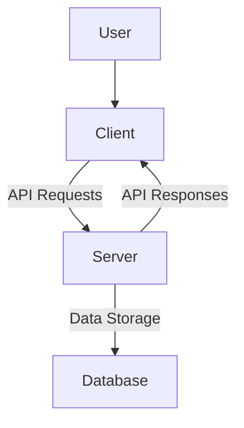

# CodeViz Research Context

> **Note**: This file contains research context from CodeViz. Most recent contexts are at the bottom.

---

## Research Query

regenerat it

*Session: 84e0416a8ba6cbfe688bada29834f1b1 | Generated: 7/14/2025, 4:18:05 PM*

### Analysis Summary

# Smart Shopping Assistant Codebase Overview

This report provides a high-level overview of the **Smart Shopping Assistant** codebase, detailing its primary components and their interrelationships. The project is structured into two main parts: a **client-side frontend** and a **server-side backend**.

## High-Level Architecture

The **Smart Shopping Assistant** operates as a client-server application. The **client** ([client/](client/)) is a web-based user interface responsible for presenting information and interacting with the user. It communicates with the **server** ([server/](server/)), which acts as the backend, providing data and business logic through an API.

## Client-Side Application

The **client** application, located in the [client/](client/) directory, is built using **React** and **Vite**. It provides the user interface for the Smart Shopping Assistant.

### Purpose
The primary purpose of the **client** is to render the user interface, handle user interactions, and display shopping-related information. It fetches data from the **server** and presents it to the user in an intuitive manner.

### Internal Structure
The core of the client application resides within the [client/src/](client/src/) directory.
*   **Entry Point**: The application starts with [main.jsx](client/src/main.jsx), which renders the main [App.jsx](client/src/App.jsx) component.
*   **Main Application Component**: [App.jsx](client/src/App.jsx) serves as the root component, orchestrating the layout and routing of different pages.
*   **Pages**: The [client/src/pages/](client/src/pages/) directory contains top-level components representing different views or pages of the application:
    *   [Home.jsx](client/src/pages/Home.jsx): Likely the main landing page.
    *   [Error.jsx](client/src/pages/Error.jsx): Handles error display.
    *   [NextPage.jsx](client/src/pages/NextPage.jsx): Another example page.
*   **Components**: Reusable UI elements are organized in the [client/src/components/](client/src/components/) directory:
    *   [Footer.jsx](client/src/components/Footer.jsx): Common footer component.
    *   [Navbar.jsx](client/src/components/Navbar.jsx): Navigation bar component.
*   **Assets**: Static assets like images are stored in [client/src/assets/](client/src/assets/).
*   **Configuration**: Project dependencies and scripts are defined in [package.json](client/package.json), and the Vite build configuration is in [vite.config.js](client/vite.config.js).

### External Relationships
The **client** interacts primarily with the **server** by making API requests to fetch and send data.

## Server-Side Application

The **server** application, located in the [server/](server/) directory, provides the backend API for the Smart Shopping Assistant. It is likely built using **Python**.

### Purpose
The primary purpose of the **server** is to handle business logic, manage data persistence, and expose API endpoints for the **client** application.

### Internal Structure
The core components of the server application are:
*   **Main Application**: [main.py](server/main.py) is expected to be the entry point for the server application, likely defining the API routes and application setup.
*   **Database Interaction**: [database.py](server/database.py) is responsible for handling all interactions with the database, abstracting database operations.
*   **Product Logic**: [products.py](server/products.py) likely contains the business logic and API endpoints related to product management.
*   **Dependencies**: Python package dependencies are listed in [requirements.txt](server/requirements.txt).

### External Relationships
The **server** serves API responses to the **client** and interacts with a database (details of which are abstracted by [database.py](server/database.py)) for data storage and retrieval.